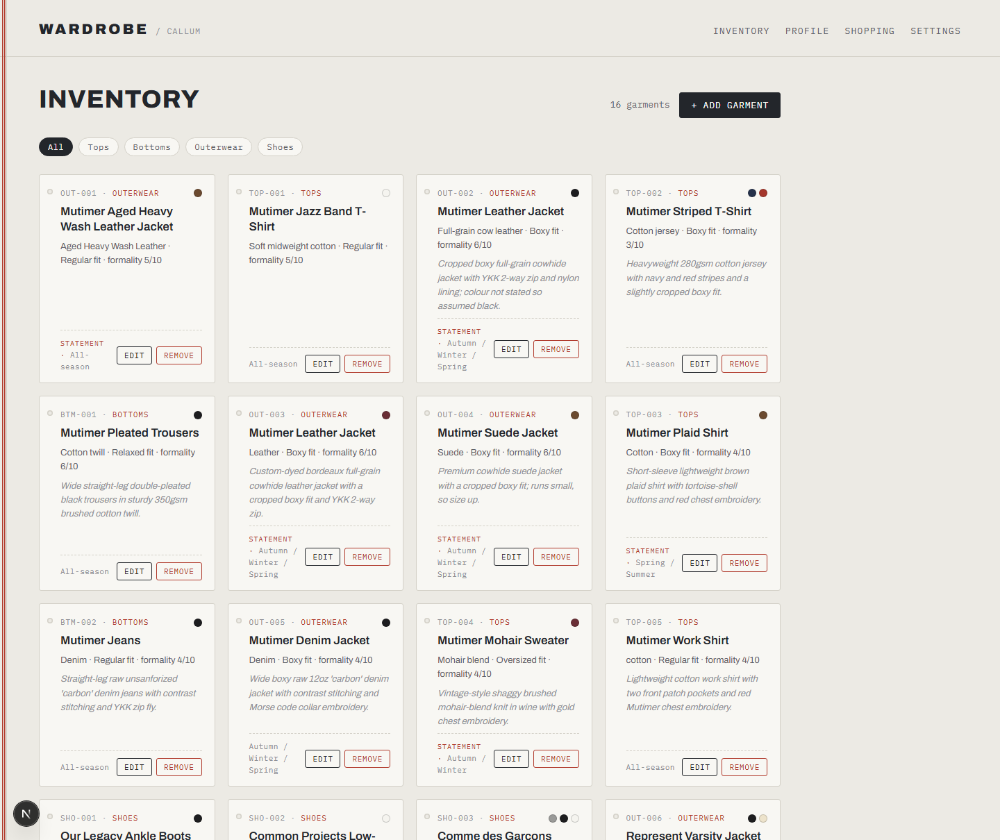
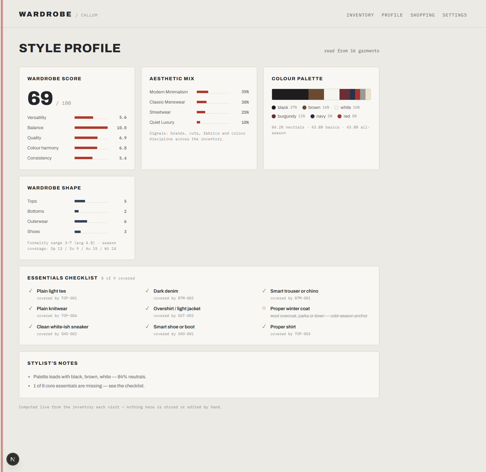

# Wardrobe

> An AI-powered personal wardrobe manager — log garments, get a live read on your style, and receive researched shopping recommendations that fill the real gaps.


Add an item by pasting a product URL, a written description, or a photo — Claude
extracts every attribute (category, fabric, fit, formality, seasonality) into a
clean, structured record. As the inventory grows, the app builds an explainable
**style profile** and can go and research real, purchasable products that would
most improve the wardrobe.

|  Inventory  |  Style profile  |
| :---------: | :-------------: |
|  |  |

<sub>Editorial, monochrome UI in Archivo + IBM Plex Mono. The style profile is computed live from the inventory — every score is explainable, not model-generated.</sub>

## Highlights

- 🧠 **AI garment extraction** — paste a URL, description, or drop a photo; Claude returns a fully structured item via **Zod-validated tool output** (no brittle string parsing).
- 📦 **Batch import** — feed a list of product links and log them all in a single AI pass, with per-link success/failure reporting.
- 📊 **Explainable style profile** — aesthetics breakdown, colour palette, formality range, an essentials checklist, and five scored dimensions (versatility, balance, quality, colour harmony, consistency) — all computed by **deterministic heuristics**, so every number is traceable, not hallucinated.
- 🛍️ **Researched recommendations** — Claude uses live **web search + fetch** tools to find 4–6 high-impact additions, each with a real product URL, current price, the gap it fills, and which owned items it pairs with.
- 🔌 **Two AI backends, zero-key option** — bring an Anthropic API key, *or* fall back to a locally installed **Claude Code CLI** (billed against a Claude Pro/Max subscription — no API key required).
- 💾 **Human-readable storage** — the entire wardrobe lives in versionable JSON files under [`wardrobe/`](wardrobe/), with a self-maintaining per-category ID index.

## Screens

| Route | Purpose |
|---|---|
| `/` | Inventory — browse, filter, add, edit, and quick-add items |
| `/profile` | Live style profile: aesthetics, palette, scores, essentials checklist |
| `/shopping` | AI-researched product recommendations |
| `/settings` | Climate, budget, preferred brands, and AI backend / API key |

## How it works

```
  Add item                         Analyse                       Shop
  ────────                         ───────                       ────
  URL / text / photo               inventory.json                style profile + settings
        │                                │                              │
        ▼                                ▼                              ▼
  ┌───────────────┐   Zod-typed   ┌──────────────┐            ┌──────────────────┐
  │ Claude extract │ ───────────▶ │ buildProfile │            │ Claude + web tools│
  │  (SDK / CLI)   │              │  (heuristics)│            │  research → Zod   │
  └───────────────┘              └──────────────┘            └──────────────────┘
        │                                │                              │
        ▼                                ▼                              ▼
   inventory.json                  scores + palette            recommendations.json
```

- **Extraction** ([`lib/ai.ts`](lib/ai.ts)) fetches and strips the product page to text, then asks Claude for a garment record. With an API key it uses `messages.parse` with a `zodOutputFormat` so the response is schema-guaranteed; otherwise it shells out to the Claude Code CLI and robustly extracts the JSON.
- **Analysis** ([`lib/analysis.ts`](lib/analysis.ts)) is pure, testable TypeScript — rule-based aesthetic scoring, a neutrals-aware palette, brand/material quality tiers, and a core-essentials checklist. No model call, so the profile is instant and explainable.
- **Recommendations** ([`lib/ai.ts`](lib/ai.ts)) run an agentic research turn with server-side `web_search`/`web_fetch` tools (resuming on `pause_turn`), then a second structured pass converts the prose into validated `Recommendation` objects — dropping anything without a real URL.
- **Storage** ([`lib/store.ts`](lib/store.ts)) reads/writes JSON with graceful fallbacks and keeps `meta` and the category index in sync on every write.

## Tech stack

Next.js 15 (App Router) · React 19 · TypeScript · [`@anthropic-ai/sdk`](https://www.npmjs.com/package/@anthropic-ai/sdk) · Zod · file-based JSON persistence · Google Fonts (Archivo + IBM Plex Mono)

## Getting started

```bash
npm install
npm run dev          # http://localhost:3000
```

> Next.js 15 needs Node 18.18+ (ideally Node 20/22). On Windows, [`run.cmd`](run.cmd)
> launches the app with a portable Node 22 install if the system Node is too old.

### AI backend

Pick **one** (configured under **Settings → AI**, or via environment):

- **Anthropic API key** — set `ANTHROPIC_API_KEY`, or paste a key in Settings.
- **Claude Code CLI** — install and log into [Claude Code](https://claude.com/claude-code); the app auto-detects it and runs on your Claude subscription with no key.

Without either, item logging and recommendations are disabled but the rest of the app works.

## Project structure

```
app/            Next.js routes + API handlers (extract, items, settings, suggest)
components/     ItemForm, QuickAdd
lib/            ai.ts · analysis.ts · store.ts · claudeCli.ts · constants.ts
wardrobe/       inventory.json · recommendations.json · style-profile.md  (your data)
```

## License

[MIT](LICENSE) © Callum Simpson
